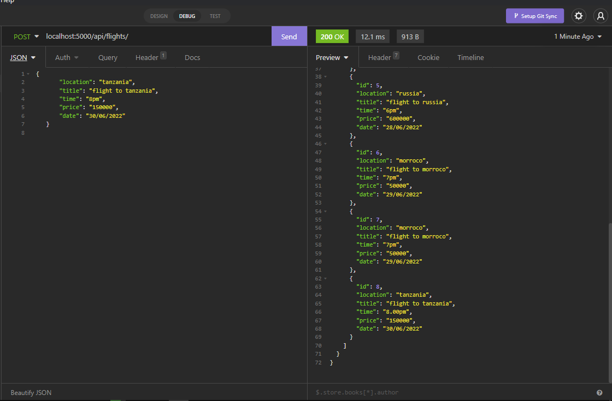

# **FLIGHT Api**
## How to Run
- port = 5000;
- first Command = npm install to get all the required dependencies
- Command = npm start;
## Prerequisites
### This API covers `CRUD` operations
### The Api covers flight to these countries with their respective `IDs`
1. Canada
2. Nigeria
3. Australia
4. Kenya
5. Russia

### When getting a single flight use IDs as indicated above instead of respective location destination.
--- 

## Below are screenshots of API outputs from different endpoints

### 1. Get Method  `All Flights`

### 2. Get Method  `Single Flight`

### 3. Post Method  `Add or Book Flights`

### 4. Patch Method `Update flights`

### 5. Delete Method `Delete Flights`
